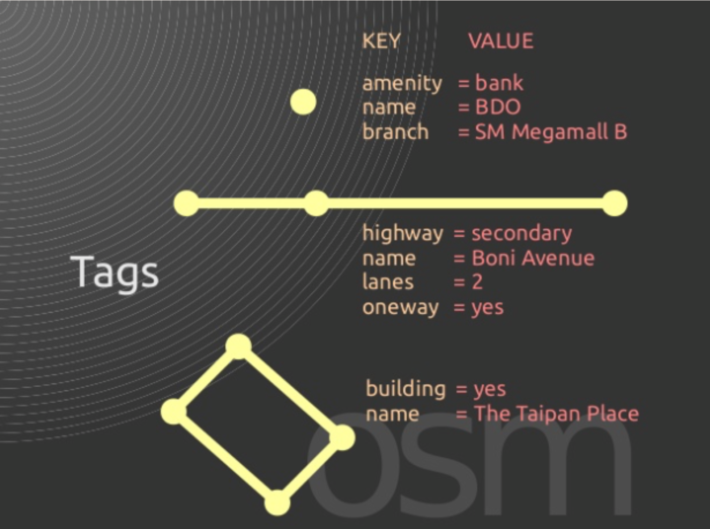
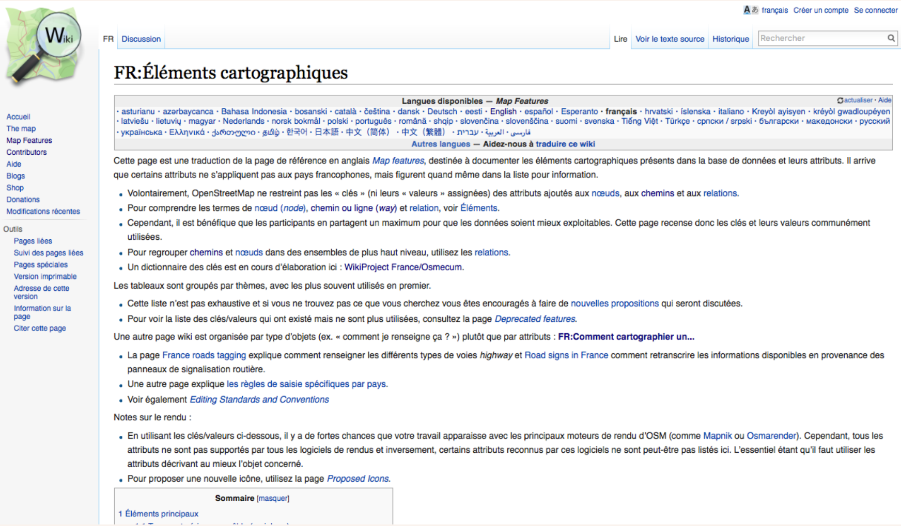
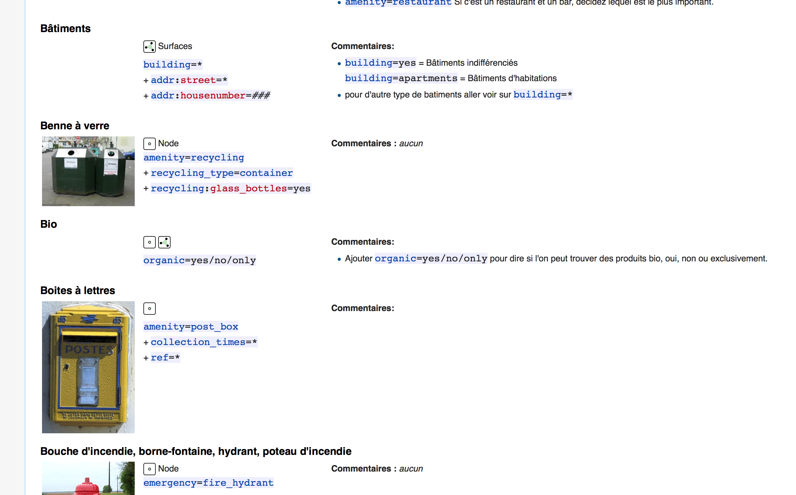
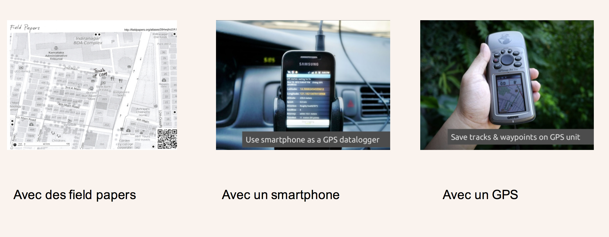
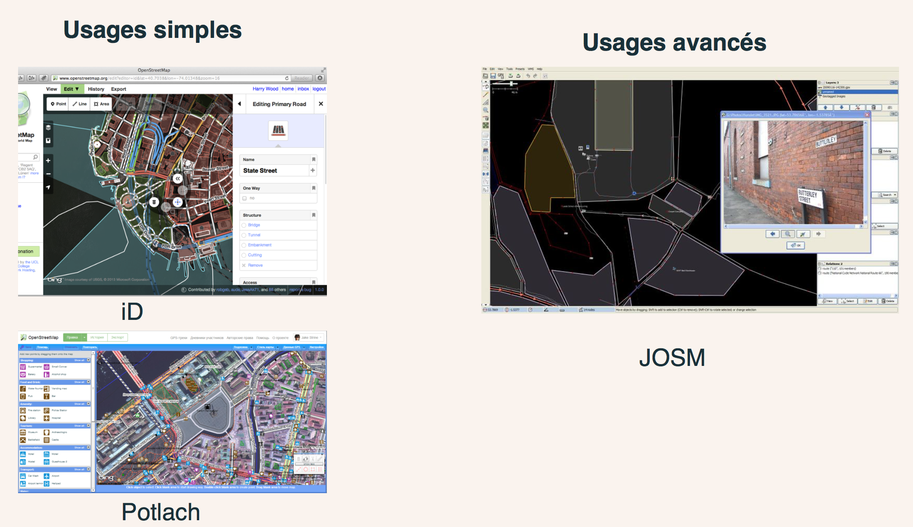

layout: true
  

`r paste0("
", params$event, " 

")` 

---
class: center, middle

Retrouvez les matériaux sur https://github.com/datactivist/atelier-osm/

Ces slides en ligne : http://datactivist.coop/atelier-osm/

Les contenus créés par Datactivist sont placés sous [licence Creative Commons CC-BY-SA](https://creativecommons.org/licenses/by-sa/3.0/deed.fr). 

---
#Qui suis-je ?

* J'ai fait ma [thèse en sociologie sur l'ouverture des données publiques](https://pastel.archives-ouvertes.fr/tel-01458098) pour comprendre comment concrètement les données étaient ouvertes. 

* Je suis le co-fondateur de [datactivi.st](datactivi.st), une société coopérative qui accompagne des organisations dans l'ouverture de leurs données et dans la réutilisation de données ouvertes. 

* Je suis membre fondateur d'[Open Knowledge France](okfn.fr) et de l'[Ecole des données](ecoledesdonnees.org). 

---
#Objectifs de l'atelier

.pull-left[
* Découvrir le fonctionnement des tags dans OSM 

* Montrer les données derrière la carte

* Apprécier la richesse de la base de données d'OpenStreetMap

* Inciter à contribuer]
.pull-right[]

---
#A qui ça s'adresse ?
.pull-left[

]
.pull-right[
* Novices qui découvrent OSM et veulent apprendre à contribuer

* Porteurs/ses de projets qui cherchent des données

* Contributeurs/trices pour détecter les angles morts dans les données OSM 

* Producteurs/trices de données publiques qui détiennent des données utiles à la communauté OSM

* Médiateurs/trices qui veulent former à OSM en quelques minutes]
---
#Déroulé de l'atelier

L'atelier dure 30 minutes : 

* Découverte des tags dans OSM 

* Exercice de recherche de tags 

* Présentation du fonctionnement d'Overpass Turbo 

* Exercice : faire des requetes ciblées dans OSM 

.footnote[
Pour une présentation plus large sur les données crowdsourcées : https://github.com/datactivist/formation_crowdsourcing_poitiers]
---
# Petite histoire d'OSM 

.pull-left[

* 2004 : lancement par Steve Coast

* Fin 2005 : 1000 usagers

* Aout 2006 : création de la fondation OpenStreetMap

* Décembre 2006 : ajout des images satellite de Yahoo

* Janvier 2013 : 1 million de contributeurs

* Mai 2013 : possibilité de contribuer directement depuis le site

* Mai 2015 : 2 millions de contributeurs
]
.pull-right[
]
---
## Les objets d'OpenStreetMap
.reduite[ ]
.footnote[CC BY-SA esambale on slideshare]
---
#Un monde de tags
.reduite[.center[]]
.footnote[CC BY-SA esambale on slideshare]
---
#Le principe d'un tag : KEY=VALUE
.reduite[.center[]]
.footnote[CC BY-SA esambale on slideshare]
---
##« Elements cartographiques » : la bible des tags
.reduite[.center[]]
.footnote[http://wiki.openstreetmap.org/wiki/FR:Éléments_cartographiques]
---
## Comment cartographier un ... ? 
.reduite[.center[]]
.footnote[[Lien vers la page wiki](http://wiki.openstreetmap.org/wiki/FR:Comment_cartographier_un..)]
---
## Exercice : trouver les tags suivants
.pull-left[

1. Autoroute 

2. Piste cyclable

3. Musée

4. Aéroport

5. Boulangerie

]

---
## Solution : trouver les tags suivants
.pull-left[

1. Autoroute 

2. Piste cyclable

3. Musée

4. Aéroport

5. Boulangerie
]
.pull-right[
1. Highway=motorway 

2. highway=cycleway ou cycleway=*

3. Tourism=museum

4. Aeroway=aerodrome

5. Shop=bakery]
---
##Découverte d’Overpass
.reduite[]
.footnote[http://overpass-turbo.eu]
---
#Exercice : cartographier les éléments suivants

* Les boulangeries à Angers

* Les pistes cyclables à Auxerre

* Les aéroports en Bourgogne

* Les boites aux lettres à Aix en Provence 

**Plus dur :**

* Les lignes électriques en corse

* Les « potelets » à Marseille
---
#On en fait quoi maintenant ? 
.reduite[]
.footnote[http://http://umap.openstreetmap.fr]
---
# Comment collecter des données sur le terrain ?
.reduite[]
---
# Comment soumettre des données ?
.reduite[]
---
class:inverse, middle, center
# Merci

Me contacter : samuel@datactivist.coop

Suggestions : https://github.com/datactivist/atelier-osm/issues
